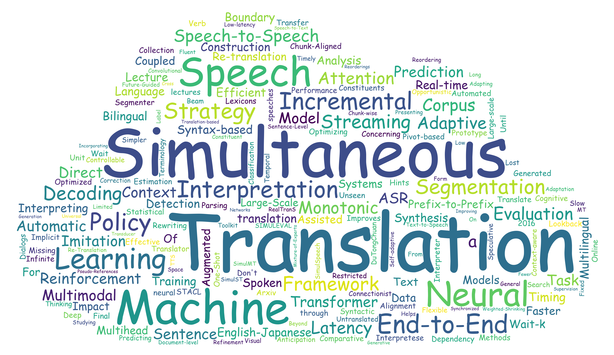

# Awesome Simultaneous Translation

This repository collects the tookits, common datasets and paper list related to the research on **Simultaneous Translation**. It is a great honor if this repository brings some help or reference to your research.:blush:

This repository is continuously updating...

## Tookits

- [Fairseq](https://github.com/pytorch/fairseq): a sequence modeling toolkit, covering the machine translation, speech translation and simultaneous translation (both text-to-text and speech-to-text).
- [SimulEval](https://github.com/facebookresearch/SimulEval): a general evaluation framework for simultaneous translation on text and speech.

## Datasets

- Conventional text-to-text translation dataset:
  - **IWSLT15 English-Vietnamese**: 133K sentence pairs. [[Link](https://nlp.stanford.edu/projects/nmt/)]
  - **WMT15 German-English**: 4.5M sentence pairs. [[Link](https://www.statmt.org/wmt15/)]
  - **WMT14 English-French**: 36.3 sentence pairs. [[Link](https://www.statmt.org/wmt14/)]
- Conventional speech-to-text translation dataset:
  - **MuST-C**: multilingual speech-to-text translation corpus with 8 language pairs. [[Link](https://ict.fbk.eu/must-c)]
- Simultaneous Interpretation Datasets:
  - **BSTC Chinese-English**: 68 hours. [[Link](https://ai.baidu.com/broad/introduction?dataset=bstc)]
  - **NAIST-SIC English-Japanese**: 22 hours.[[Link](https://dsc-nlp.naist.jp/data/NAIST-SIC/)]

## Tutorials & Talks

PACLIC 2016: **The Challenge of Simultaneous Speech Translation**. Anoop Sarkar. [[Link](https://aclanthology.org/Y16-1003)]

EMNLP 2020: **Simultaneous Translation**. Liang Huang, Colin Cherry, Mingbo Ma, Naveen Arivazhagan, and Zhongjun He.  [[Link](https://aclanthology.org/2020.emnlp-tutorials.6)]

AMTA 2020: **Simultaneous Speech Translation in Google Translate**. Jeff Pitman. [[Link](https://aclanthology.org/attachments/2020.amta-user.17.Presentation.pdf)]

## Paper List

This is a paper list of Simultaneous Translation, organized by publication year. 

### 2002

- Translation Unit Concerning Timing of Simultaneous Translation. *LREC 2002*. [[PDF](http://www.lrec-conf.org/proceedings/lrec2002/pdf/136.pdf)]

### 2006

- Simultaneous English-Japanese Spoken Language Translation Based on Incremental Dependency Parsing and Transfer. *ACL 2006*. [[PDF](https://aclanthology.org/P06-2088)]

### 2007

- Simultaneous translation of lectures and speeches. *Mach Translat 2007*.  [[PDF](https://ccc.inaoep.mx/~villasen/bib/Simultaneous%20translation%20of%20lectures%20and%20speeches.pdf)]

### 2009

- End-to-End Evaluation in Simultaneous Translation. *EACL 2009*. [[PDF](https://aclanthology.org/E09-1040)]

### 2010

- Stream-based Translation Models for Statistical Machine Translation. *NAACL 2010*. [[PDF](https://aclanthology.org/N10-1062/)]

- Construction of Chunk-Aligned Bilingual Lecture Corpus for Simultaneous Machine Translation. *LREC 2010*. [[PDF](http://www.lrec-conf.org/proceedings/lrec2010/pdf/581_Paper.pdf)]

### 2012

- Real-time Incremental Speech-to-Speech Translation of Dialogs. *NAACL 2012*. [[PDF](https://aclanthology.org/N12-1048)]

### 2013

- Incremental Segmentation and Decoding Strategies for Simultaneous Translation. *IJCNLP 2013*. [[PDF](https://aclanthology.org/I13-1141)]

### 2014

- Optimizing Segmentation Strategies for Simultaneous Speech Translation. *ACL 2014*. [[PDF](https://aclanthology.org/P14-2090)]

- Collection of a Simultaneous Translation Corpus for Comparative Analysis. *IREC 2014*. [[PDF](http://www.lrec-conf.org/proceedings/lrec2014/pdf/162_Paper.pdf)]

- Don't Until the Final Verb Wait: Reinforcement Learning for Simultaneous Machine Translation. *EMNLP 2014*. [[PDF](https://aclanthology.org/D14-1140)]

- Towards Simultaneous Interpreting: the Timing of Incremental Machine Translation and Speech Synthesis. *IWSLT 2014*. [[PDF](https://aclanthology.org/2014.iwslt-papers.2)]

- Segmentation Strategies for Streaming Speech Translation. *NAACL 2014*. [[PDF](https://www.aclweb.org/anthology/N13-1023)]

### 2015

- Automated Simultaneous Interpretation: Hints of a Cognitive Framework for Machine Translation. *HyTra 2015*. [[PDF](https://aclanthology.org/W15-4106)]

- Syntax-based Simultaneous Translation through Prediction of Unseen Syntactic Constituents. *ACL 2015*. [[PDF](https://aclanthology.org/P15-1020)]

- Syntax-based Rewriting for Simultaneous Machine Translation. *EMNLP 2015*. [[PDF](https://aclanthology.org/D15-1006)]

### 2016
- An Efficient and Effective Online Sentence Segmenter for Simultaneous Interpretation. *WAT 2016*. [[PDF](https://aclanthology.org/W16-4613)]

- Interpretese vs. Translationese: The Uniqueness of Human Strategies in Simultaneous Interpretation. *NAACL 2016*. [[PDF](https://aclanthology.org/N16-1111)] [[Code](https://github.com/hhexiy/interpretese)]

- Simultaneous Sentence Boundary Detection and Alignment with Pivot-based Machine Translation Generated Lexicons. *LREC 2016*. [[PDF](https://aclanthology.org/L16-1348)]

- A Prototype Automatic Simultaneous Interpretation System. *COLING 2016*. [[PDF](https://aclanthology.org/C16-2007)]

- Simultaneous Machine Translation using Deep Reinforcement Learning. *ICML 2016*  [[PDF](http://docs.wixstatic.com/ugd/3195dc_538b63de8e2644b782db920c55f74650.pdf)]

- Can neural Machine Translation do Simultaneous Translation? *Arxiv 2016*. [[PDF](https://arxiv.org/pdf/1606.02012)]

###  2017

- Online and Linear-Time Attention by Enforcing Monotonic Alignments. *ICML 2017*. [[PDF](https://arxiv.org/pdf/1704.00784.pdf)] [[Code](https://github.com/craffel/mad)]

- Learning to Translate in Real-time with Neural Machine Translation. *EACL 2017*.  [[PDF](https://aclanthology.org/E17-1099)] [[Code](https://github.com/yifanjun233/dl4mt-simul-trans)]

###  2018

- Simultaneous Translation using Optimized Segmentation. *AMTA 2018*. [[PDF](https://aclanthology.org/W18-1815)]

- Automatic Estimation of Simultaneous Interpreter Performance. *ACL 2018*. [[PDF](https://aclanthology.org/P18-2105)] [[Code](https://github.com/craigastewart/qe_sim_interp)]

- Incremental Decoding and Training Methods for Simultaneous Translation in Neural Machine Translation. *NAACL 2018*. [[PDF](https://aclanthology.org/N18-2079)] [[Code](https://github.com/fdalvi/seq2seq-attn-stream)]

-  Statistical Analysis of Missing Translation in Simultaneous Interpretation Using A Large-scale Bilingual Speech Corpus. *LREC 2018*. [[PDF](https://aclanthology.org/L18-1676)]

- Prediction Improves Simultaneous Neural Machine Translation. *EMNLP 2018*. [[PDF](https://aclanthology.org/D18-1337)] [[Code](https://github.com/ashkanalinejad/Real-time-translator)]

- KIT Lecture Translator: Multilingual Speech Translation with One-Shot Learning. *COLING 2018*. [[PDF](https://aclanthology.org/C18-2020)]

- Monotonic Chunkwise Attention. *ICLR 2018*. [[PDF](https://openreview.net/pdf?id=Hko85plCW)]  [[Code](https://github.com/craffel/mocha)] 

###  2019

- Monotonic Infinite Lookback Attention for Simultaneous Machine Translation. *ACL 2019*. [[PDF](https://aclanthology.org/P19-1126)]

- STACL: Simultaneous Translation with Implicit Anticipation and Controllable Latency using Prefix-to-Prefix Framework. *ACL 2019*. [[PDF](https://aclanthology.org/P19-1289)]

- Simultaneous Translation with Flexible Policy via Restricted Imitation Learning. *ACL 2019*. [[PDF](https://aclanthology.org/P19-1582)]

- Lost in Interpretation: Predicting Untranslated Terminology in Simultaneous Interpretation. *NAACL 2019*. [[PDF](https://aclanthology.org/N19-1010)] [[Code](https://github.com/nvog/lost-in-interpretation)]

- Simpler and Faster Learning of Adaptive Policies for Simultaneous Translation. *EMNLP 2019*. [[PDF](https://aclanthology.org/D19-1137)]

- Speculative Beam Search for Simultaneous Translation. *EMNLP 2019*. [[PDF](https://aclanthology.org/D19-1144)]

- Thinking Slow about Latency Evaluation for Simultaneous Machine Translation. *Arxiv 2019*. [[PDF](https://arxiv.org/pdf/1906.00048.pdf)]

- DuTongChuan: Context-aware Translation Model for Simultaneous Interpreting. *Arxiv 2019*. [[PDF](https://arxiv.org/pdf/1907.12984)]

- Simultaneous Neural Machine Translation using Connectionist Temporal Classification. *Arxiv 2019*. [[PDF](https://arxiv.org/pdf/1911.11933.pdf)]

###  2020

- Towards Multimodal Simultaneous Neural Machine Translation. *WMT 2020*. [[PDF](https://aclanthology.org/2020.wmt-1.70)] [[Code](https://github.com/toshohirasawa/mst)]

- Opportunistic Decoding with Timely Correction for Simultaneous Translation. *ACL 2020*. [[PDF](https://aclanthology.org/2020.acl-main.42)]

- Simultaneous Translation Policies: From Fixed to Adaptive. *ACL 2020*. [[PDF](https://aclanthology.org/2020.acl-main.254)]

- SimulSpeech: End-to-End Simultaneous Speech to Text Translation. *ACL 2020*. [[PDF](https://aclanthology.org/2020.acl-main.350)]

- Monotonic Multihead Attention. *ICLR 2020*.  [[PDF](https://openreview.net/pdf?id=Hyg96gBKPS)] [[Code](https://github.com/pytorch/fairseq/tree/6f847c8654d56b4d1b1fbacec027f47419426ddb/examples/simultaneous_translation)]

- Learning Adaptive Segmentation Policy for Simultaneous Translation. *EMNLP 2020*. [[PDF](https://aclanthology.org/2020.emnlp-main.178)]

- Simultaneous Machine Translation with Visual Context. *EMNLP 2020*. [[PDF](https://aclanthology.org/2020.emnlp-main.184)] [[Code](https://github.com/ImperialNLP/pysimt)]

- Direct Segmentation Models for Streaming Speech Translation. *EMNLP 2020*. [[PDF](https://aclanthology.org/2020.emnlp-main.206.pdf)] [[Code](https://github.com/jairsan/Speech_Translation_Segmenter)]

- SIMULEVAL: An Evaluation Toolkit for Simultaneous Translation. *EMNLP 2020*. [[PDF](https://aclanthology.org/2020.emnlp-demos.19)] [[Code](https://github.com/facebookresearch/SimulEval)]

- Incremental Text-to-Speech Synthesis with Prefix-to-Prefix Framework. *EMNLP 2020 findings*. [[PDF](https://aclanthology.org/2020.findings-emnlp.346)]

- Fluent and Low-latency Simultaneous Speech-to-Speech Translation with Self-adaptive Training. *EMNLP 2020 findings*. [[PDF](https://aclanthology.org/2020.findings-emnlp.349)]

- A General Framework for Adaptation of Neural Machine Translation to Simultaneous Translation. *AACL 2020*. [[PDF](https://aclanthology.org/2020.aacl-main.23)]

- SimulMT to SimulST: Adapting Simultaneous Text Translation to End-to-End Simultaneous Speech Translation. *AACL 2020*. [[PDF](https://aclanthology.org/2020.aacl-main.58)] [[Code](https://github.com/pytorch/fairseq)]

- Re-Translation Strategies For Long Form, Simultaneous, Spoken Language Translation. *ICASSP 2020*  [[PDF](https://ieeexplore.ieee.org/stamp/stamp.jsp?tp=&arnumber=9054585)]

- Efficient Wait-k Models for Simultaneous Machine Translation. *InterSpeech 2020*. [[PDF](http://www.interspeech2020.org/index.php?m=content&c=index&a=show&catid=282&id=611)] [[Code](https://github.com/elbayadm/attn2d)]

- Presenting Simultaneous Translation in Limited Space. *Arxiv 2020*.  [[PDF](https://arxiv.org/pdf/2009.09016)]

- Simultaneous Speech-to-Speech Translation System with Neural Incremental ASR, MT, and TTS. *Arxiv 2020*.  [[PDF](https://arxiv.org/pdf/2011.04845.pdf)]

- Low Latency ASR for Simultaneous Speech Translation. *Arxiv 2020*.  [[PDF](https://arxiv.org/pdf/2003.09891)]

###  2021

- Monotonic Simultaneous Translation with Chunk-wise Reordering and Refinement. *WMT2021*. [[PDF](https://aclanthology.org/2021.wmt-1.119)]

- Simultaneous Neural Machine Translation with Constituent Label Prediction. *WMT 2021*. [[PDF](https://aclanthology.org/2021.wmt-1.120)]

- Future-Guided Incremental Transformer for Simultaneous Translation. *AAAI 2021*. [[PDF](https://arxiv.org/pdf/2012.12465.pdf)]

- Studying The Impact Of Document-level Context On Simultaneous Neural Machine Translation. *Machine Translation 2021*. [[PDF](https://aclanthology.org/2021.mtsummit-research.17)]

- Beyond Sentence-Level End-to-End Speech Translation: Context Helps. *ACL 2021*. [[PDF](https://aclanthology.org/2021.acl-long.200)] [[Code](https://github.com/bzhangGo/zero)]

- RealTranS: End-to-End Simultaneous Speech Translation with Convolutional Weighted-Shrinking Transformer. *ACL 2021 findings*. [[PDF](https://aclanthology.org/2021.findings-acl.218)]

- Direct Simultaneous Speech-to-Text Translation Assisted by Synchronized Streaming ASR. *ACL 2021 findings*. [[PDF](https://aclanthology.org/2021.findings-acl.406)]

- Multilingual Simultaneous Neural Machine Translation. *ACL 2021 findings*. [[PDF](https://aclanthology.org/2021.findings-acl.420)]

- Universal Simultaneous Machine Translation with Mixture-of-Experts Wait-k Policy. *EMNLP 2021*. [[PDF](https://aclanthology.org/2021.emnlp-main.581)] [[Code](https://github.com/ictnlp/MoE-Waitk)]

- Cross Attention Augmented Transducer Networks for Simultaneous Translation. *EMNLP 2021*. [[PDF](https://aclanthology.org/2021.emnlp-main.4)] [[Code](https://github.com/danliu2/caat)]

- Translation-based Supervision for Policy Generation in Simultaneous Neural Machine Translation. *EMNLP 2021*. [[PDF](https://aclanthology.org/2021.emnlp-main.130)] [[Code](https://github.com/sfu-natlang/supervised-simultaneous-mt)]

- Improving Simultaneous Translation by Incorporating Pseudo-References with Fewer Reorderings. *EMNLP 2021*. [[PDF](https://aclanthology.org/2021.emnlp-main.473)]

- A Generative Framework for Simultaneous Machine Translation. *EMNLP 2021*. [[PDF](https://aclanthology.org/2021.emnlp-main.536)]

- It Is Not As Good As You Think! Evaluating Simultaneous Machine Translation on Interpretation Data. *EMNLP 2021*. [[PDF](https://aclanthology.org/2021.emnlp-main.537)] [[Code](https://github.com/mingzi151/InterpretationData)]

- Stream-level Latency Evaluation for Simultaneous Machine Translation. *EMNLP 2021 findings*. [[PDF](https://aclanthology.org/2021.findings-emnlp.58)] [[Code](https://github.com/jairsan/Stream-level_Latency_Evaluation_for_Simultaneous_Machine_Translation)]

- MiSS: An Assistant for Multi-Style Simultaneous Translation. *EMNLP 2021 Demo*. [[PDF](https://aclanthology.org/2021.emnlp-demo.1)]

- Learning Coupled Policies for Simultaneous Machine Translation using Imitation Learning. *EACL 2021*. [[PDF](https://aclanthology.org/2021.eacl-main.233)] [[Code](https://github.com/Monash-NLP-ML-Group/arthur-eacl2021)]

- Exploiting Multimodal Reinforcement Learning for Simultaneous Machine Translation. *EACL 2021*. [[PDF](https://aclanthology.org/2021.eacl-main.281)] [[Code](https://github.com/ImperialNLP/pysimt)]

- An Empirical Study Of End-To-End Simultaneous Speech Translation Decoding Strategies. *ICASSP 2021* [[PDF](https://arxiv.org/pdf/2103.03233.pdf)]

- Streaming Simultaneous Speech Translation With Augmented Memory Transformer. *ICASSP 2021* [[PDF](https://ieeexplore.ieee.org/stamp/stamp.jsp?tp=&arnumber=9414897)]

- Impact of Encoding and Segmentation Strategies on End-to-End Simultaneous Speech Translation. *Interspeech 2021*. [[PDF](https://arxiv.org/pdf/2104.14470)]

- Visualization: the missing factor in Simultaneous Speech Translation. *CLIC-it 2021*. [[PDF](http://ceur-ws.org/Vol-3033/paper22.pdf)]

- UniST: Unified End-to-end Model for Streaming and Non-streaming Speech Translation. *Arxiv 2021*. [[PDF](https://arxiv.org/pdf/2109.07368.pdf)]

- Faster Re-translation Using Non-Autoregressive Model For Simultaneous Neural Machine Translation. *Arxiv 2021*. [[PDF](https://arxiv.org/pdf/2012.14681)]

- Learn to Use Future Informationin Simultaneous Translation. *Arxiv 2021* [[PDF](https://arxiv.org/pdf/2007.05290)]

- Simultaneous Multi-Pivot Neural Machine Translation. *Arxiv 2021*. [[PDF](https://arxiv.org/pdf/2104.07410)]

- Full-Sentence Models Perform Better in Simultaneous Translation Using the Information Enhanced Decoding Strategy. *Arxiv 2021*. [[PDF](https://arxiv.org/pdf/2105.01893)]

- Decision Attentive Regularization to Improve Simultaneous Speech Translation Systems. *Arxiv 2021*. [[PDF](https://arxiv.org/pdf/2110.15729)]

- Direct Simultaneous Speech-to-Speech Translation with Variational Monotonic Multihead Attention. *Arxiv 2021*. [[PDF](https://arxiv.org/pdf/2110.15729)]

### 2022

- Modeling Dual Read/Write Paths for Simultaneous Machine Translation. *ACL 2022*. [[PDF](https://arxiv.org/pdf/2203.09163)] [[Code](https://github.com/ictnlp/Dual-Path)]

- Reducing Position Bias in Simultaneous Machine Translation with Length-Aware Framework. *ACL 2022*. [[PDF](https://arxiv.org/pdf/2203.09053)]

- From Simultaneous to Streaming Machine Translation by Leveraging Streaming History. *ACL 2022*. [[PDF](https://arxiv.org/pdf/2203.02459)] 

- Gaussian Multi-head Attention for Simultaneous Machine Translation. *ACL 2022 findings*. [[PDF](https://arxiv.org/pdf/2203.09072)] [[Code](https://github.com/ictnlp/GMA)]

## Workshops

### IWSLT 2020

- ON-TRAC Consortium for End-to-End and Simultaneous Speech Translation Challenge Tasks at IWSLT 2020. [[PDF](https://aclanthology.org/2020.iwslt-1.2)]

- Start-Before-End and End-to-End: Neural Speech Translation by AppTek and RWTH Aachen University. [[PDF](https://aclanthology.org/2020.iwslt-1.3)]

- KIT's IWSLT 2020 SLT Translation System. [[PDF](https://aclanthology.org/2020.iwslt-1.4)]

- End-to-End Simultaneous Translation System for IWSLT2020 Using Modality Agnostic Meta-Learning. [[PDF](https://aclanthology.org/2020.iwslt-1.5)]

- ELITR Non-Native Speech Translation at IWSLT 2020. [[PDF](https://aclanthology.org/2020.iwslt-1.25)]

- Re-translation versus Streaming for Simultaneous Translation. [[PDF](https://aclanthology.org/2020.iwslt-1.27)]

- Towards Stream Translation: Adaptive Computation Time for Simultaneous Machine Translation. [[PDF](https://aclanthology.org/2020.iwslt-1.28)]

- Neural Simultaneous Speech Translation Using Alignment-Based Chunking. [[PDF](https://aclanthology.org/2020.iwslt-1.29)]

### AutoSimTrans 2020  

- Dynamic Sentence Boundary Detection for Simultaneous Translation. [[PDF](https://aclanthology.org/2020.autosimtrans-1.1)]

### ASLTRW 2021

- Operating a Complex SLT System with Speakers and Human Interpreters. [[PDF](https://aclanthology.org/2021.mtsummit-asltrw.3)]

- Simultaneous Speech Translation for Live Subtitling: from Delay to Display. [[PDF](https://aclanthology.org/2021.mtsummit-asltrw.4)]

- ### IWSLT 2021
- The USTC-NELSLIP Systems for Simultaneous Speech Translation Task at IWSLT 2021. [[PDF](https://aclanthology.org/2021.iwslt-1.2)]

- NAIST English-to-Japanese Simultaneous Translation System for IWSLT 2021 Simultaneous Text-to-text Task. [[PDF](https://aclanthology.org/2021.iwslt-1.3)]

- The University of Edinburgh's Submission to the IWSLT21 Simultaneous Translation Task. [[PDF](https://aclanthology.org/2021.iwslt-1.4)]

- Without Further Ado: Direct and Simultaneous Speech Translation by AppTek in 2021. [[PDF](https://aclanthology.org/2021.iwslt-1.5)]

- The Volctrans Neural Speech Translation System for IWSLT 2021. [[PDF](https://aclanthology.org/2021.iwslt-1.6)]

- Large-Scale English-Japanese Simultaneous Interpretation Corpus: Construction and Analyses with Sentence-Aligned Data. [[PDF](https://aclanthology.org/2021.iwslt-1.27)]

- Towards the evaluation of automatic simultaneous speech translation from a communicative perspective. [[PDF](https://aclanthology.org/2021.iwslt-1.29)]

- Tag Assisted Neural Machine Translation of Film Subtitles. [[PDF](https://aclanthology.org/2021.iwslt-1.30)]

### AutoSimTrans 2021

- ICT's System for AutoSimTrans 2021: Robust Char-Level Simultaneous Translation. [[PDF](https://aclanthology.org/2021.autosimtrans-1.1)]

- BIT's system for AutoSimulTrans2021. [[PDF](https://aclanthology.org/2021.autosimtrans-1.2)]

- XMU's Simultaneous Translation System at NAACL 2021. [[PDF](https://aclanthology.org/2021.autosimtrans-1.3)]

- System Description on Automatic Simultaneous Translation Workshop. [[PDF](https://aclanthology.org/2021.autosimtrans-1.4)]

- BSTC: A Large-Scale Chinese-English Speech Translation Dataset. [[PDF](https://aclanthology.org/2021.autosimtrans-1.5/)]

## Contact

If this repository is helpful to you, welcome to :star: it !

If you have any suggestions or some related papers are not included, feel free to contact me with: `zhangshaolei20z@ict.ac.cn`.

> Shaolei Zhang
>
> Ph.D. Student Candidate
>
> Key Lab. of Intelligent Information Processing
>
> Institute of Computing Technology, Chinese Academy of Sciences